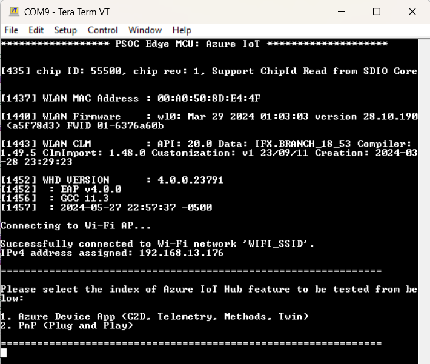
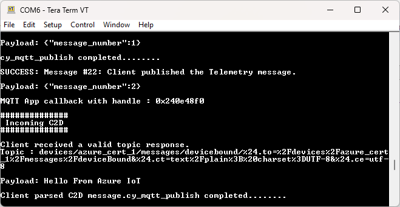
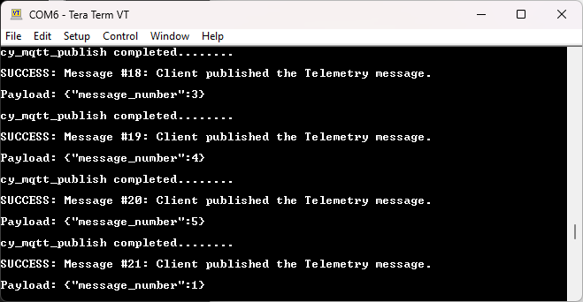
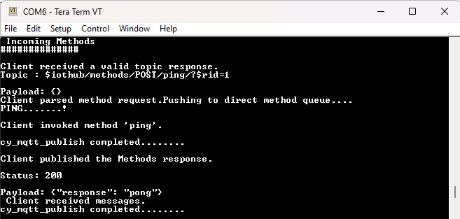
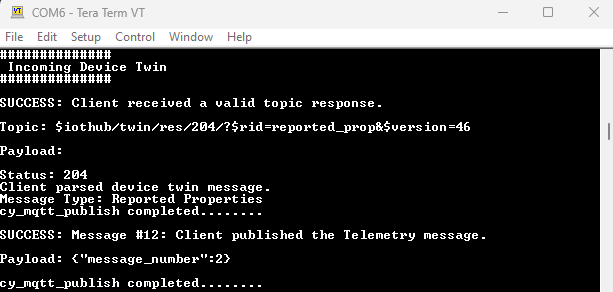

# PSOC&trade; Edge MCU: Connecting to Azure IoT using Azure SDK for C

This code example demonstrates how to connect to Azure IoT services using the Azure Software Development Kit (SDK) for Embedded C and Infineon's Wi-Fi connectivity SDK. This code example showcases various features, including Internet of Things (IoT) Hub, Cloud-to-Device (C2D) messaging, Telemetry, Methods, Device Twin, and Plug and Play (PnP).

In this example, the [Azure C SDK port](https://github.com/Infineon/azure-c-sdk-port) is used in conjunction with the [Mosquitto (MQTT)](https://github.com/Infineon/mqtt) library to connect to the Azure cloud. The IoT device authentication mode can be either X.509 certificate-based or shared access signature (SAS)-based. During startup, the application displays a menu showcasing the features of the Azure IoT Hub service. Depending on the selected use case, message transmission occurs either from the cloud to the MCU device or vice versa.

This code example has a three project structure: CM33 secure, CM33 non-secure, and CM55 projects. All three projects are programmed to the external QSPI flash and executed in Execute in Place (XIP) mode. Extended boot launches the CM33 secure project from a fixed location in the external flash, which then configures the protection settings and launches the CM33 non-secure application. Additionally, CM33 non-secure application enables CM55 CPU and launches the CM55 application.

[View this README on GitHub.](https://github.com/Infineon/mtb-example-psoc-edge-azure-iot)

[Provide feedback on this code example.](https://cypress.co1.qualtrics.com/jfe/form/SV_1NTns53sK2yiljn?Q_EED=eyJVbmlxdWUgRG9jIElkIjoiQ0UyMzk5MTAiLCJTcGVjIE51bWJlciI6IjAwMi0zOTkxMCIsIkRvYyBUaXRsZSI6IlBTT0MmdHJhZGU7IEVkZ2UgTUNVOiBDb25uZWN0aW5nIHRvIEF6dXJlIElvVCB1c2luZyBBenVyZSBTREsgZm9yIEMiLCJyaWQiOiJzbmVoYSBzYXJhdmFuYWt1bWFyIiwiRG9jIHZlcnNpb24iOiIyLjEuMCIsIkRvYyBMYW5ndWFnZSI6IkVuZ2xpc2giLCJEb2MgRGl2aXNpb24iOiJNQ0QiLCJEb2MgQlUiOiJJQ1ciLCJEb2MgRmFtaWx5IjoiUFNPQyJ9)

See the [Design and implementation](docs/design_and_implementation.md) for the functional description of this code example.


## Requirements

- [ModusToolbox&trade;](https://www.infineon.com/modustoolbox) v3.6 or later (tested with v3.6)
- Board support package (BSP) minimum required version: 1.0.0
- Programming language: C
- Associated parts: All [PSOC&trade; Edge MCU](https://www.infineon.com/products/microcontroller/32-bit-psoc-arm-cortex/32-bit-psoc-edge-arm) parts


## Supported toolchains (make variable 'TOOLCHAIN')

- GNU Arm&reg; Embedded Compiler v14.2.1 (`GCC_ARM`) – Default value of `TOOLCHAIN`
- Arm&reg; Compiler v6.22 (`ARM`)
- IAR C/C++ Compiler v9.50.2 (`IAR`)
- LLVM Embedded Toolchain for Arm&reg; v19.1.5 (`LLVM_ARM`)


## Supported kits (make variable 'TARGET')

- [PSOC&trade; Edge E84 Evaluation Kit](https://www.infineon.com/KIT_PSE84_EVAL) (`KIT_PSE84_EVAL_EPC2`) – Default value of `TARGET`
- [PSOC&trade; Edge E84 Evaluation Kit](https://www.infineon.com/KIT_PSE84_EVAL) (`KIT_PSE84_EVAL_EPC4`)


## Hardware setup

This example uses the board's default configuration. See the kit user guide to ensure that the board is configured correctly.

Ensure the following jumper and pin configuration on board.
- BOOT SW must be in the HIGH/ON position
- J20 and J21 must be in the tristate/not connected (NC) position


## Software setup

See the [ModusToolbox&trade; tools package installation guide](https://www.infineon.com/ModusToolboxInstallguide) for information about installing and configuring the tools package.

<details><summary><b>Python</b></summary>

Download Python version 3.8-3.12 from the official website: [Python](https://www.python.org). After installation, add the Python directory to your system path environment variables. This will allow you to easily run Python commands from anywhere in your terminal.

</details>

Open a CLI terminal and navigate to the *scripts* directory. Run the following command to ensure the required modules are installed ("Requirement already satisfied" is printed).

   ```
   pip install -r requirements.txt
   ```

> **Note:** The CySecureTools v6.1.0 or later will be used in this example, which will be downloaded as a part of pip install using "requirements.txt".

This example requires the setup of Azure IoT Hub on the Microsoft Azure portal. Additionally, the visual studio code and its Azure IoT tool extension need to be set up with the created Azure Hub.

**Reference links**:

- [Azure Hub setup](https://docs.microsoft.com/en-us/azure/iot-hub/iot-hub-create-through-portal#create-an-iot-hub)

- [Visual Studio Code setup](https://code.visualstudio.com/download)

- [Azure IoT tools](https://marketplace.visualstudio.com/items?itemName=vsciot-vscode.azure-iot-toolkit)

- [Set Azure IoT Hub in VS code](https://devblogs.microsoft.com/iotdev/introducing-azure-iot-tools-for-visual-studio-code/#set-up-your-azure-iot-hub-in-vs-code)

</details>

Install a terminal emulator if you do not have one. Instructions in this document use [Tera Term](https://teratermproject.github.io/index-en.html).

This example requires no additional software or tools.

## Authentication credentials setup

This section contains the steps to setup the X.509 or SAS credentials-based on the hardware for the Azure IoT Hub.

<details><summary><b>Credentials setup for non-secured platform </b></summary>

For SAS-based authentication, the token generation steps are mentioned in the [Operation](#operation) section. <br>
For using X.509-based certificate authentication, the steps are as follows:

   <details><summary><b>X.509 certificate-based authentication mode</b></summary>
   <br>
   Use the following steps to generate the device's X.509 self-signed certificate and private key to setup the X.509 authentication-based device on Azure IoT Hub.

1. In the _< application >_ directory, create a _certificates_ directory

2. Run the following command in the modus-shell in the _certificates_ folder to generate the device private key

   ```
   openssl req -newkey rsa:2048 -nodes -keyout dev_priv_key.pem
   ```

   Enter the additional information, as shown in the following example to complete the above command. The `Common Name` can be the user's choice but must match the _device ID_ on the Azure IoT Hub portal is created in the following steps:

   The `A challenge password` and `An optional company name` fields are left blank.

   ```
   Country Name (2 letter code) [XX]:US
   State or Province Name (full name) []:CA
   Locality Name (e.g, city) [Default City]:SJ
   Organization Name (e.g, company) [Default Company Ltd]:IFX
   Organizational Unit Name (e.g, section) []:INFINEON
   Common Name (e.g, your name or your server's hostname) []:azure_dps_dev_test1
   Email Address []:

   Please enter the following 'extra' attributes
   to be sent with your certificate request
   A challenge password []:
   An optional company name []:
   ```

3. Copy the _x509_config.cfg_ file from the _scripts_ folder to _certificates_ folder

4. Run the following command in the modus-shell in the _certificates_ directory to generate the X.509 certificate

   > **Note**: The value of the common name field in the following command - `CN` can be the user's choice but must match the _device ID_ on the Azure IoT Hub portal is created as mentioned in the following steps:

   ```
   openssl req -new -days 1024 -nodes -x509 -key dev_priv_key.pem -out device_cert.pem -extensions client_auth -config x509_config.cfg -subj "/CN=azure_dps_dev_test1"
   ```

5. Run the following command in the modus-shell in the _certificates_ directory to get the SHA thumbprint of the device certificate created in **Step 4**. Copy the fingerprint generated in the following command

      ```
      openssl x509 -noout -fingerprint -in device_cert.pem | sed 's/://g'| sed 's/\(SHA1 Fingerprint=\)//g'
      ```

      Example of a fingerprint from the previous command:

      ```
      902E7A49F252A49D0AB30AB1D2FBEAE702495F2F
      ```

6. For **without Azure DPS flow** (Without Trusted Firmware-M asset) - In the Azure portal, see [Azure device setup](https://docs.microsoft.com/en-us/azure/iot-hub/iot-hub-create-through-portal#register-a-new-device-in-the-iot-hub) and create the Azure IoT device using _X.509 self-signed option_. Paste the same fingerprint copied in **Step 6** in both "primary" and "secondary" thumbprints. The _device name_ should be same as `Common Name` used in **Step 1** of this section where the root certificate is created <br>

7. Download [DigiCert Global G2 Root certificate](https://cacerts.digicert.com/DigiCertGlobalRootG2.crt.pem) and place it in the _certificates_ folder then run the below command to convert the certificate from `.crt` to `.pem`. The `out` parameter must be `azure_rootCA.pem`

      ```
      openssl x509 -inform der -in DigiCertGlobalRootG2.crt -out azure_rootCA.pem
      ```

8. In proj_cm33_ns/mqtt_main.h, set `azure_root_ca_certificate` to the _azure_RootCA.pem_ and set device certificate and device key that was generated in Step 4. The pem format of the certificates and keys needs to be used in the file. Use _scripts/format_X509_cert_key.py_ to generate the formatted pem to be used in proj_cm33_ns/mqtt_main.h.
Copy and paste _scripts/format_X509_cert_key.py_ file in _certificates_ folder and use it as follows:

      ```
      python format_X509_cert_key.py azure_rootCA.pem device_cert.pem dev_priv_key.pem
      ``` 

   </details>

</details>

## Operation

See [Using the code example](docs/using_the_code_example.md) for instructions on creating a project, opening it in various supported IDEs, and performing tasks, such as building, programming, and debugging the application within the respective IDEs.

1. Connect the board to your PC using the provided USB cable through the KitProg3 USB connector

2. Select from either of the following methods for authentication of the Azure IoT device with the Azure Hub

      <details><summary><b>Shared access signature (SAS)-based authentication mode </b></summary>

      1. Set the `SAS_TOKEN_AUTH` macro to `1` in proj_cm33_ns/azure_common.h

      2. Update the files as follows:

         <details><summary><b> Non-secure hardware </b></summary>

         <details><summary><b>Without Azure Device Provisioning Service (DPS) (Without Trusted Firmware-M asset)</b></summary>

         The following steps are used to generate the output of the **Azure Device App (C2D, Telemetry, Methods, Device Twin)** and **PnP (Plug and Play)** menu options of this ModusToolbox&trade; application.

         1. Create a SAS authentication based device on the Azure IoT Hub by referring to [Azure device setup](https://docs.microsoft.com/en-us/azure/iot-hub/iot-hub-create-through-portal#register-a-new-device-in-the-iot-hub)

         2. Generate a SAS token for the device using the following instructions as mentioned in  [SAS token generation](https://github.com/Microsoft/vscode-azure-iot-toolkit/wiki/Generate-SAS-Token-for-Device). The VS Code's [Get device info](https://github.com/Microsoft/vscode-azure-iot-toolkit/wiki/Get-Device-Info) can be used for acquiring device information like the host name and device ID

         3. In proj_cm33_ns/azure_common.h, set the `SAS_TOKEN_LOCATION_FLASH` macro as `true`

         4. In proj_cm33_ns/mqtt_main.h update the following macros:
            - Update the device ID in `MQTT_CLIENT_IDENTIFIER_AZURE_SAS`
            - Update host name/hub name of the created IoT Hub in `IOT_DEMO_SERVER_AZURE`
            - Update device ID in `IOT_AZURE_USERNAME`
            - Update the generated SAS token in `IOT_AZURE_PASSWORD`

         </details>

         </details>

      </details>

      <details><summary><b>X.509 certificate-based authentication mode</b></summary>

      1. Set the `SAS_TOKEN_AUTH` macro to `0` and `SAS_TOKEN_LOCATION_FLASH` to `false` in proj_cm33_ns/azure_common.h

      2. Update the files as follows:

         <details><summary><b> Non-secure hardware </b></summary>

         <details><summary><b>Without Azure Device Provisioning Service (DPS) (Without Trusted Firmware-M asset)</b></summary>

            The following steps are used to generate the output of the **Azure Device App (C2D, Telemetry, Methods, Device Twin)** and **PnP (Plug and Play)** menu options of this ModusToolbox&trade; application.
         
            1. Create an X.509-based device, it's a certificate and private key for Azure IoT Hub by referring to [Authentication credentials setup](#authentication-credentials-setup)

            2. In proj_cm33_ns/mqtt_main.h update the following macros:

               - Update the device ID in the `MQTT_CLIENT_IDENTIFIER_AZURE_CERT` macro
               - Update host name/hub name on which the device will be registered in  macro `IOT_DEMO_SERVER_AZURE`
               - Update the device ID in the `IOT_AZURE_USERNAME` macro
               - Update the pem format value of certificates and keys in the `azure_root_ca_certificate`, `azure_client_cert`, and `azure_client_key` as mentioned in the [Authentication credentials setup](#authentication-credentials-setup) section for a non-secure kit

         </details>

         </details>

      </details>

3. Update the Wi-Fi details `WIFI_SSID` and `WIFI_PASSWORD` in the proj_cm33_ns/mqtt_main.h file

     > **Note:** Build the application if there are any changes made.

4. Open a terminal program and select the KitProg3 COM port. Set the serial port parameters to 8N1 and 115200 baud

5. After programming, the application starts automatically. The application presents a menu at the start, select the Azure IoT feature to be demonstrated. The **Azure Device App** demonstrates four features of the IoT Hub - **Cloud to Device, Telemetry, Methods, and Device Twin**. The other demo is for **Plug and Play**

   Once the demo is completed, the application disconnects from the Azure MQTT broker and Wi-Fi. To run other features, press the reset button and re-run the application.

   **Figure 3: Azure IoT features menu**

   

   ### Cloud-to-device (C2D) messaging

   The **Azure Device App** receives the incoming C2D messages sent from the Azure IoT Hub to the device.

   To send a C2D message, select your device's **Message to Device** tab in the Azure portal in the IoT Hub. Enter a message in the **Message Body** and click **Send Message**.

   **Figure 4** is an example message from the cloud printed on the terminal.

   **Figure 4: C2D message**

   

   ### Telemetry

   The **Azure Device App** sends 100 telemetry messages to the Azure IoT Hub. If the network disconnects, the application will exit. The device metrics can be checked on the Azure Hub for analysis of Telemetry, **Metrics -> Add metric -> select "Telemetry messages send attempts"**.

   **Figure 5: Telemetry message**

   

   ### Methods

   The **Azure Device App** receives incoming method commands invoked from the Azure IoT Hub to the device. It receives all method commands sent from the service. If the network disconnects while waiting for a message, the application will exit.

   To send a method command, select your device's **Direct Method** tab in the Azure portal in the IoT Hub. Enter a method named `ping` in the **Method Name** field and click **Invoke Method**, which if successful will return the following JSON payload visible in the **Result** section of the **Direct Method** tab in the Azure portal.

   `{"response": "pong"}`

   No other method commands are supported. If any other methods are attempted to be invoked, the log will report that the method is not found.

   **Figure 6: Method response message**

   

   ### Device twin

   The **Azure Device App** uses the Azure IoT Hub to get the device twin document, send a reported property message, and receive up to five desired property messages. When the desired property message is received, the application will update the twin property locally and send a reported property message back to the service. If the network disconnects while waiting for a message from the Azure IoT Hub, the application will exit.

   A property named `Test_count` is supported for this application. To send a device twin desired property message, select the device's **Device Twin** tab in the Azure portal in the IoT Hub. Add the `Test_count` property along with the corresponding value to the `desired` section of the JSON, an example is shown below. Click **Save** to update the twin document and send the twin message from the cloud to the device.

   ```
   "properties": {
        "desired": {
            "Test_count": 141,
            "$metadata": {
                "$lastUpdated": "2024-05-23T11:19:40.5236057Z"
            },
            "$version": 1
        },
   ```

   **Figure 7: Twin message**

   

   The application would report back the property `Test_count` to the Azure server. Upon selecting the **Refresh button** on the **Device Twin** portal, the updated `Test_count` can be seen in the reported section.

   ### Plug and play (PnP)

      The application connects an IoT Plug and Play enabled device with the **Digital Twin Model ID** (DTMI). The application waits for a message and will exit if the network disconnects.

      To interact with the application, use the Azure IoT Explorer or use the Azure portal directly. The capabilities are Device twin, Direct method (Command), and Telemetry.

      - **Device Twin**

         Two device twin properties are supported in this application:

         1. The desired property is named `targetTemperature` with a `double` value for the desired temperature

         2. A reported property named `maxTempSinceLastReboot` with a `double` value for the highest temperature reached since device boot

         To send a device twin desired property message, select your device's **Device Twin** tab in the Azure portal. Add the `targetTemperature` property along with a corresponding value to the desired section of the JSON object, as shown below. Select **Save** to update the twin document and send the twin message to the device.

         ```
         "properties": {
            "desired": {
                  "targetTemperature": 68.5,
                  "$metadata": {
                     "$lastUpdated": "2024-05-23T11:25:53.7315952Z"
                  },
                  "$version": 1
            },
         ```

         When the desired property message is received, the application will update the twin property locally and send a reported property of the same name back to the service. This message will include a set of "ack" values: `ac` for the HTTP-like ack code, `av` for the ack version of the property, and an optional `ad` for an ack description.

         Upon selecting the **Refresh** button on the **Device Twin** portal, the updated properties can be seen in the reported section as shown below:

         ```
         {
            "properties":
            {
               "reported":
               {
                  "targetTemperature":
                  {
                     "value": 68.5,
                     "ac": 200,
                     "av": 14,
                     "ad": "success"
                  },
                  "maxTempSinceLastReboot": 74.3,
                  ...
               }
            }
         }
         ```

      - **Direct method (command)**

         One device command is supported in this application: `getMaxMinReport`.

         If any other commands are attempted to be invoked, the log will report that the command is not found. To invoke a command, select your device's **Direct Method** tab in the Azure portal. Enter the command name `getMaxMinReport` in the **Method Name** field along with a payload using an ISO 8061 time format and select **Invoke method**. A sample payload is as follows:

         `"2023-08-18T17:09:29-0700"`

         The command will send back to the service a response containing the following JSON payload with the updated values in each field. It is visible in the **Result** section of the **Direct Method** tab in the Azure portal.  An example response is shown below:

         > **Note:** The system time at the time of sending the response will be reflected in endTime.

         ```
            {"status":400,"payload":{"maxTemp":68.5,"minTemp":22,"avgTemp":45.25,"startTime":"2020-08-18T17:09:29-0700","endTime":"1970-01-01T00:00:31+0000"}}
         ```

      - **Telemetry**

         The device sends the value of current temperature in JSON format with the field name `temperature` as telemetry data using the above two methods - Twin and Direct method.


### Wi-Fi Throughput
This code example is configured to run on a CM33 core at a frequency of 200 MHz from external flash memory. However, this setup may result in lower throughput compared to running the code in internal memory (SRAM). For optimal performance, it is recommended to run the code example on a CM55 core at 400 MHz, leveraging internal memory (i.e., System SRAM/SoCMEM). For guidance on achieving better throughput, refer to the README file of the Wi-Fi Bluetooth tester application (mtb-psoc-edge-wifi-bluetooth-tester).

## Related resources

Resources  | Links
-----------|----------------------------------
Application notes  | [AN235935](https://www.infineon.com/AN235935) – Getting started with PSOC&trade; Edge E8 MCU on ModusToolbox&trade; software <br> [AN236697](https://www.infineon.com/AN236697) – Getting started with PSOC&trade; MCU and AIROC&trade; Connectivity devices 
Code examples  | [Using ModusToolbox&trade;](https://github.com/Infineon/Code-Examples-for-ModusToolbox-Software) on GitHub
Device documentation | [PSOC&trade; Edge MCU datasheets](https://www.infineon.com/products/microcontroller/32-bit-psoc-arm-cortex/32-bit-psoc-edge-arm#documents) <br> [PSOC&trade; Edge MCU reference manuals](https://www.infineon.com/products/microcontroller/32-bit-psoc-arm-cortex/32-bit-psoc-edge-arm#documents)
Development kits | Select your kits from the [Evaluation board finder](https://www.infineon.com/cms/en/design-support/finder-selection-tools/product-finder/evaluation-board)
Libraries  | [mtb-dsl-pse8xxgp](https://github.com/Infineon/mtb-dsl-pse8xxgp) – Device support library for PSE8XXGP <br> [retarget-io](https://github.com/Infineon/retarget-io) – Utility library to retarget STDIO messages to a UART port <br> [wifi-core-freertos-lwip-mbedtls](https://github.com/Infineon/wifi-core-freertos-lwip-mbedtls) -This repo includes core components needed for Wi-Fi connectivity support. The library bundles FreeRTOS, lwIP TCP/IP stack, Mbed TLS for security, Wi-Fi host driver (WHD), Wi-Fi Connection Manager (WCM), secure sockets, connectivity utilities, and configuration files
Tools  | [ModusToolbox&trade;](https://www.infineon.com/modustoolbox) – ModusToolbox&trade; software is a collection of easy-to-use libraries and tools enabling rapid development with Infineon MCUs for applications ranging from wireless and cloud-connected systems, edge AI/ML, embedded sense and control, to wired USB connectivity using PSOC&trade; Industrial/IoT MCUs, AIROC&trade; Wi-Fi and Bluetooth&reg; connectivity devices, XMC&trade; Industrial MCUs, and EZ-USB&trade;/EZ-PD&trade; wired connectivity controllers. ModusToolbox&trade; incorporates a comprehensive set of BSPs, HAL, libraries, configuration tools, and provides support for industry-standard IDEs to fast-track your embedded application development

<br>


## Other resources

Infineon provides a wealth of data at [www.infineon.com](https://www.infineon.com) to help you select the right device, and quickly and effectively integrate it into your design.


## Document history

Document title: *CE239910* – *PSOC&trade; Edge MCU: Connecting to Azure IoT using Azure SDK for C*

 Version | Description of change
 ------- | ---------------------
 1.x.0   | New code example <br> Early access release
 2.0.0   | GitHub release 
 2.1.0   | Updated README
<br>


All referenced product or service names and trademarks are the property of their respective owners.

The Bluetooth&reg; word mark and logos are registered trademarks owned by Bluetooth SIG, Inc., and any use of such marks by Infineon is under license.

PSOC&trade;, formerly known as PSoC&trade;, is a trademark of Infineon Technologies. Any references to PSoC&trade; in this document or others shall be deemed to refer to PSOC&trade;.

---------------------------------------------------------

© Cypress Semiconductor Corporation, 2023-2025. This document is the property of Cypress Semiconductor Corporation, an Infineon Technologies company, and its affiliates ("Cypress").  This document, including any software or firmware included or referenced in this document ("Software"), is owned by Cypress under the intellectual property laws and treaties of the United States and other countries worldwide.  Cypress reserves all rights under such laws and treaties and does not, except as specifically stated in this paragraph, grant any license under its patents, copyrights, trademarks, or other intellectual property rights.  If the Software is not accompanied by a license agreement and you do not otherwise have a written agreement with Cypress governing the use of the Software, then Cypress hereby grants you a personal, non-exclusive, nontransferable license (without the right to sublicense) (1) under its copyright rights in the Software (a) for Software provided in source code form, to modify and reproduce the Software solely for use with Cypress hardware products, only internally within your organization, and (b) to distribute the Software in binary code form externally to end users (either directly or indirectly through resellers and distributors), solely for use on Cypress hardware product units, and (2) under those claims of Cypress's patents that are infringed by the Software (as provided by Cypress, unmodified) to make, use, distribute, and import the Software solely for use with Cypress hardware products.  Any other use, reproduction, modification, translation, or compilation of the Software is prohibited.
<br>
TO THE EXTENT PERMITTED BY APPLICABLE LAW, CYPRESS MAKES NO WARRANTY OF ANY KIND, EXPRESS OR IMPLIED, WITH REGARD TO THIS DOCUMENT OR ANY SOFTWARE OR ACCOMPANYING HARDWARE, INCLUDING, BUT NOT LIMITED TO, THE IMPLIED WARRANTIES OF MERCHANTABILITY AND FITNESS FOR A PARTICULAR PURPOSE.  No computing device can be absolutely secure.  Therefore, despite security measures implemented in Cypress hardware or software products, Cypress shall have no liability arising out of any security breach, such as unauthorized access to or use of a Cypress product. CYPRESS DOES NOT REPRESENT, WARRANT, OR GUARANTEE THAT CYPRESS PRODUCTS, OR SYSTEMS CREATED USING CYPRESS PRODUCTS, WILL BE FREE FROM CORRUPTION, ATTACK, VIRUSES, INTERFERENCE, HACKING, DATA LOSS OR THEFT, OR OTHER SECURITY INTRUSION (collectively, "Security Breach").  Cypress disclaims any liability relating to any Security Breach, and you shall and hereby do release Cypress from any claim, damage, or other liability arising from any Security Breach.  In addition, the products described in these materials may contain design defects or errors known as errata which may cause the product to deviate from published specifications. To the extent permitted by applicable law, Cypress reserves the right to make changes to this document without further notice. Cypress does not assume any liability arising out of the application or use of any product or circuit described in this document. Any information provided in this document, including any sample design information or programming code, is provided only for reference purposes.  It is the responsibility of the user of this document to properly design, program, and test the functionality and safety of any application made of this information and any resulting product.  "High-Risk Device" means any device or system whose failure could cause personal injury, death, or property damage.  Examples of High-Risk Devices are weapons, nuclear installations, surgical implants, and other medical devices.  "Critical Component" means any component of a High-Risk Device whose failure to perform can be reasonably expected to cause, directly or indirectly, the failure of the High-Risk Device, or to affect its safety or effectiveness.  Cypress is not liable, in whole or in part, and you shall and hereby do release Cypress from any claim, damage, or other liability arising from any use of a Cypress product as a Critical Component in a High-Risk Device. You shall indemnify and hold Cypress, including its affiliates, and its directors, officers, employees, agents, distributors, and assigns harmless from and against all claims, costs, damages, and expenses, arising out of any claim, including claims for product liability, personal injury or death, or property damage arising from any use of a Cypress product as a Critical Component in a High-Risk Device. Cypress products are not intended or authorized for use as a Critical Component in any High-Risk Device except to the limited extent that (i) Cypress's published data sheet for the product explicitly states Cypress has qualified the product for use in a specific High-Risk Device, or (ii) Cypress has given you advance written authorization to use the product as a Critical Component in the specific High-Risk Device and you have signed a separate indemnification agreement.
<br>
Cypress, the Cypress logo, and combinations thereof, ModusToolbox, PSoC, CAPSENSE, EZ-USB, F-RAM, and TRAVEO are trademarks or registered trademarks of Cypress or a subsidiary of Cypress in the United States or in other countries. For a more complete list of Cypress trademarks, visit www.infineon.com. Other names and brands may be claimed as property of their respective owners.